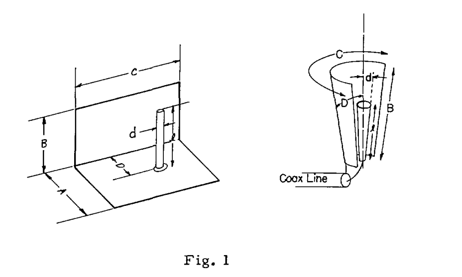
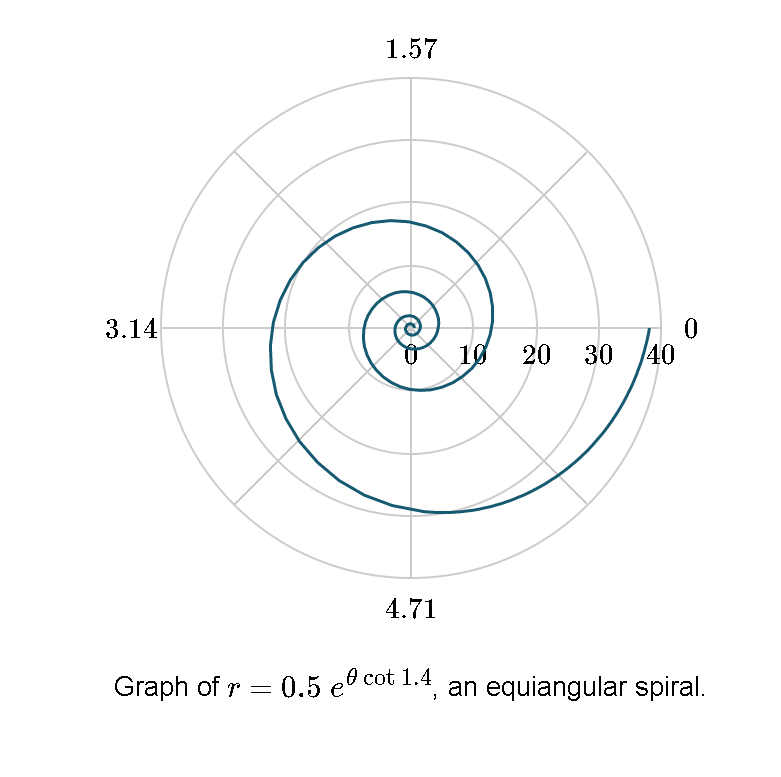
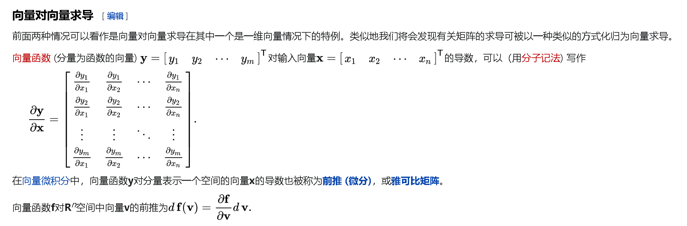

#### 文献

阅读的文献如下

V. Rumsey, “Frequency independent antennas,” in 1958 IRE International Convention Record, Mar. 1957, vol. 5, pp. 114–118, doi: 10/bt7wc7.

文献阐述了频率独立天线的理论

##### Data

无损天线的形状参数仅和角度相关时，辐射方向性图和阻抗特性与频率无关。无损天线的尺寸等比例扩大时，对应工作波长也等比扩大，此时对应的辐射方向性图和阻抗特性不变，意味着天线相对于波长的尺寸不变，则频率独立。

频率独立性天线的典型设计：

一般只和角度相关的形状是频率独立天线设计的起点，当天线尺寸不是无限大时意味着天线存在一个与频率相关的特征长度，那么设计中面对的问题就是弄清楚有限大小的结构特性能否收敛于无限大小的结构。

对于频率独立性天线而言，天线尺寸的放缩需要等效成相应的角度变换，这样天线的性能才能是宽带的。

一般频率独立天线形状球坐标系下表征为

$$r=e^{a\left(\varphi+\varphi_{o}\right)} F(\theta)$$

表明尺寸单纯是角度的函数

$$\operatorname{Kr}(\varphi)=\mathbf{r}(\varphi+C)$$

K 表征尺寸放缩倍数，K仅和C相关，K和C与$\varphi$和$r$无关:

两边对C和$\varphi$分别求导，有

\begin{equation}
	\begin{aligned}
\quad r(\varphi) \frac{d K}{d C}&=\frac{\partial r(\varphi+C)}{\partial C}\\

  \quad \mathrm{K} \frac{\mathrm{d} \mathrm{r}(\varphi)}{\mathrm{d} \varphi}&=\frac{\partial \mathrm{r}(\varphi+\mathrm{C})}{\partial \varphi}\\

  \frac{\partial \mathbf{r(\varphi+C)}}{\partial \mathbf{C}}&=\frac{d \mathbf{r}(\varphi+C)}{d(\varphi+C)}=\frac{\partial \mathbf{r}(\varphi+C)}{\partial \varphi}\\

  \therefore \quad r(\varphi) \frac{d K}{d C}&=K \frac{d r(\varphi)}{\partial \varphi}\\

  a&=\frac{1}{K} \frac{d K}{d C}\\
	\end{aligned}
\end{equation}

a独立于 $\varphi$，由此可以解得$\mathbf{r}=\mathbf{e}^{\mathbf{a}\left(\varphi+\varphi_{\mathbf{o}}\right)}$这是一个等角螺旋（equiangular spiral）的方程,详见[1] “Logarithmic spiral,” *Wikipedia*. Sep. 05, 2020, Accessed: Sep. 22, 2020. [Online]. Available: https://en.wikipedia.org/w/index.php?title=Logarithmic_spiral&oldid=976832601.

  

  因为最简单的偶机子需要两个平面，所以我们要找四条等角螺旋线，根据等角螺旋的特性可知（待考证），当a不同时，曲线会在r取有限小值时重合。因此可以让a相同，取不同的$\varphi_0$。

  当然有时候需要三维空间的金属面，接下来的问题就是找到这样的表面，其单位长度的变化等效于旋转，表面的一般函数表征为

$$r=f(\theta \varphi)\nonumber$$

 旋转之后的函数表示为

$$\mathbf{r}=f\left(\theta^{\prime} \varphi^{\prime}\right)\nonumber$$

方程要满足

$$\mathrm{Kf}\left(\theta_{\varphi}\right)=\mathrm{f}\left(\theta^{\prime} \varphi^{\prime}\right) \text { for all } \theta \varphi\nonumber$$

两侧分别对$\theta,\varphi,a1,a2,a3$求导：

\begin{gather*}
\mathbf{K} \underline{\alpha}=M \underline{\alpha}^{\prime}(2 \text { equations })\\
  r \underline{\beta}=S \underline{\alpha}^{\prime}(3 \text { equations })\\
  \end{gather*}

消去$\alpha$有：

\begin{equation}
SM^{-1}K\alpha=S\alpha^{\prime}=r\beta\nonumber
\end{equation}

为了解出$r$相对于$\theta,\varphi$的函数，需要$S,M$矩阵。

 由初始$\theta,\varphi$到$\theta^{\prime},\varphi{\prime}$的直角坐标变换矩阵记为T：

\begin{align*}
  \mathcal{T}(\alpha, \beta, \gamma) &=
  \left[\begin{array}{ccc}
  \cos \gamma & -\sin \gamma & 0 \\
  \sin \gamma & \cos \gamma & 0 \\
  0 & 0 & 1
  \end{array}\right]

  \left[\begin{array}{ccc}
  \cos \beta & 0 & \sin \beta \\
  0 & 1 & 0 \\
  -\sin \beta & 0 & \cos \beta
  \end{array}\right]

  \left[\begin{array}{ccc}
  1 & 0 & 0 \\
  0 & \cos \alpha& -\sin \alpha \\
  0 & \sin \alpha & \cos \beta
  \end{array}\right]\\

  \end{align*}

T可以由顺次绕三个坐标轴的角度(或者其他表征？？？)决定，初始$\theta,\varphi$对应的矢量：

\begin{gather*}
u=\left[\begin{array}{c}
  sin\theta cos\varphi\\
  sin\theta sin\varphi\\
  cos\theta
  \end{array}
  \right]\\

  u^{\prime}=\left[\begin{array}{c}
  sin\theta^{\prime} cos\varphi^{\prime}\\
  sin\theta^{\prime} sin\varphi^{\prime}\\
  cos\theta^{\prime}
    \end{array}
  \right]\\

  u^{\prime}=Tu
  \end{gather*}

​	坐标变换方程两侧分别对$\theta,\varphi;a1,a2,a3$求导：

\begin{gather*}
MA^{\prime}=TA\\
SA'=\frac{\partial (Tu)}{\partial P_R}
\end{gather*}

任意旋转过于复杂，我们简化成绕一个轴进行旋转

再次翻译一下我们的问题，首先对于频率独立性天线而言，尺寸的变化K要等价于某种旋转，由此可以建立方程，我们的目的是找出这种天线形状的球坐标系下的函数。已知条件，尺寸变化仅和旋转相关，天线外形仅和角度相关

\begin{gather*}
\frac{\partial K}{\partial a_1}r(\theta,\varphi)=\frac{\partial r(\theta',\varphi') }{\partial \theta'}\frac{\partial \theta'}{\partial a_1}+\frac{\partial r(\theta',\varphi') }{\partial \varphi'}\frac{\partial \varphi'}{\partial a_1}\\

\frac{\partial K}{\partial a_2}r(\theta,\varphi)=\frac{\partial r(\theta',\varphi') }{\partial \theta'}\frac{\partial \theta'}{\partial a_2}+\frac{\partial r(\theta',\varphi') }{\partial \varphi'}\frac{\partial \varphi'}{\partial a_2}\\

\frac{\partial K}{\partial a_3}r(\theta,\varphi)=\frac{\partial r(\theta',\varphi') }{\partial \theta'}\frac{\partial \theta'}{\partial a_3}+\frac{\partial r(\theta',\varphi') }{\partial \varphi'}\frac{\partial \varphi'}{\partial a_3}\\
\end{gather*}

对角度求导

\begin{gather*}
K\frac{\partial r(\theta,\varphi)}{\partial \theta}=\frac{\partial r(\theta',\varphi') }{\partial \theta'}\frac{\partial \theta'}{\partial \theta}+\frac{\partial r(\theta',\varphi') }{\partial \varphi'}\frac{\partial \varphi'}{\partial \theta}\\

K\frac{\partial r(\theta,\varphi)}{\partial \varphi}=\frac{\partial r(\theta',\varphi') }{\partial \theta'}\frac{\partial \theta'}{\partial \varphi}+\frac{\partial r(\theta',\varphi') }{\partial \varphi'}\frac{\partial \varphi'}{\partial \varphi}
\end{gather*}

简化方程认为$\theta,\varphi$旋转无关

\begin{gather*}
K\frac{\partial r(\theta,\varphi)}{\partial \theta}=\frac{\partial r(\theta',\varphi') }{\partial \theta'}\frac{\partial \theta'}{\partial \theta}\\

K\frac{\partial r(\theta,\varphi)}{\partial \varphi}=\frac{\partial r(\theta',\varphi') }{\partial \varphi'}\frac{\partial \varphi'}{\partial \varphi}
\end{gather*}

简化方程认为尺寸的某一变化仅沿Z轴转动，假设a1是表征绕Z转动的角度

\begin{equation}
\frac{\partial K}{\partial a_1}r(\theta,\varphi)=\frac{\partial r(\theta',\varphi') }{\partial \varphi'}\frac{\partial \varphi'}{\partial a_1}\\\end{equation}\nonumber

则有

\begin{gather*}
K\frac{\partial r(\theta,\varphi)}{\partial \theta}=\frac{\partial r(\theta',\varphi') }{\partial \theta'}\\

K\frac{\partial r(\theta,\varphi)}{\partial \varphi}=\frac{\partial r(\theta',\varphi') }{\partial \varphi'}\frac{\partial \varphi'}{\partial \varphi}
\end{gather*}

我们需要找到前后$\varphi$变化的关系，以及$\varphi'$与旋转间的关系

\begin{equation}
u^{\prime}=\left[\begin{array}{c}
sin\theta^{\prime} cos\varphi^{\prime}\\
sin\theta^{\prime} sin\varphi^{\prime}\\
cos\theta^{\prime}
\end{array}
\right]

=Tu

=\left(
\begin{array}{ccc}
 \cos (a_1 ) & -\sin (a_1 ) & 0 \\
 \sin (a_1 ) & \cos (a_1 ) & 0 \\
 0 & 0 & 1 \\
\end{array}
\right)

\left[\begin{array}{c}
sin\theta cos\varphi\\
sin\theta sin\varphi\\
cos\theta
\end{array}
\right]
\end{equation}\nonumber

两侧分别对$a_1$求导，对$\theta,\varphi$求导。

对$\theta$有：

\begin{equation}
\left[\begin{array}{c}
cos\theta^{\prime} cos\varphi^{\prime}\frac{\partial \theta'}{\partial \theta}-sin\theta^{\prime} sin\varphi^{\prime}\frac{\partial \varphi'}{\partial \theta}\\

sin\theta^{\prime} sin\varphi^{\prime}\frac{\partial \theta'}{\partial \theta}+sin\theta^{\prime} cos\varphi^{\prime}\frac{\partial \varphi'}{\partial \theta}\\

-sin\theta^{\prime}\frac{\partial \theta'}{\partial \theta}
\end{array}
\right]

=\left(
\begin{array}{ccc}
 \cos (a_1 ) & -\sin (a_1 ) & 0 \\
 \sin (a_1 ) & \cos (a_1 ) & 0 \\
 0 & 0 & 1 \\
\end{array}
\right)

\left[\begin{array}{c}
cos\theta cos\varphi\\
cos\theta sin\varphi\\
-sin\theta
\end{array}
\right]
\end{equation}\nonumber

化简得到：

\begin{equation}
\left[\begin{array}{c}
cos\theta cos\varphi^{\prime}\\

sin\theta sin\varphi^{\prime}\\

-sin\theta
\end{array}
\right]

=\left(
\begin{array}{ccc}
 \cos (a_1 ) & -\sin (a_1 ) & 0 \\
 \sin (a_1 ) & \cos (a_1 ) & 0 \\
 0 & 0 & 1 \\
\end{array}
\right)

\left[\begin{array}{c}
cos\theta cos\varphi\\
cos\theta sin\varphi\\
-sin\theta
\end{array}
\right]
\end{equation}

对$\varphi$有：

\begin{equation}
\left[\begin{array}{c}
cos\theta^{\prime} cos\varphi^{\prime}\frac{\partial \theta'}{\partial \varphi}-sin\theta^{\prime} sin\varphi^{\prime}\frac{\partial \varphi'}{\partial \varphi}\\

sin\theta^{\prime} sin\varphi^{\prime}\frac{\partial \theta'}{\partial \varphi}+sin\theta^{\prime} cos\varphi^{\prime}\frac{\partial \varphi'}{\partial \varphi}\\

-sin\theta^{\prime}\frac{\partial \theta'}{\partial \varphi}
\end{array}
\right]

=\left(
\begin{array}{ccc}
 \cos (a_1 ) & -\sin (a_1 ) & 0 \\
 \sin (a_1 ) & \cos (a_1 ) & 0 \\
 0 & 0 & 1 \\
\end{array}
\right)

\left[\begin{array}{c}
-sin\theta sin\varphi\\
sin\theta cos\varphi\\
cos\theta
\end{array}
\right]
\end{equation}\nonumber

化简得到：

\begin{equation}\left[\begin{array}{c}
0-sin\theta sin\varphi^{\prime}\frac{\partial \varphi'}{\partial \varphi}\\

0+sin\theta cos\varphi^{\prime}\frac{\partial \varphi'}{\partial \varphi}\\

0
\end{array}
\right]

=\left(
\begin{array}{ccc}
 \cos (a_1 ) & -\sin (a_1 ) & 0 \\
 \sin (a_1 ) & \cos (a_1 ) & 0 \\
 0 & 0 & 1 \\
\end{array}
\right)

\left[\begin{array}{c}
-sin\theta sin\varphi\\
sin\theta cos\varphi\\
cos\theta
\end{array}
\right]\end{equation}\nonumber

对a1求导得到：

\begin{equation}\left[\begin{array}{c}
cos\theta^{\prime} cos\varphi^{\prime}\frac{\partial \theta'}{\partial a_1}-sin\theta^{\prime} sin\varphi^{\prime}\frac{\partial \varphi'}{\partial a_1}\\

sin\theta^{\prime} sin\varphi^{\prime}\frac{\partial \theta'}{\partial a_1}+sin\theta^{\prime} cos\varphi^{\prime}\frac{\partial \varphi'}{\partial a_1}\\

-sin\theta^{\prime}\frac{\partial \theta'}{\partial a_1}
\end{array}
\right]

=\left(
\begin{array}{ccc}
 -sin (a_1 ) & -cos (a_1 ) & 0 \\
 cos (a_1 ) & -sin (a_1 ) & 0 \\
 0 & 0 & 0 \\
\end{array}
\right)

\left[\begin{array}{c}
sin\theta cos\varphi\\
sin\theta sin\varphi\\
cos\theta
\end{array}
\right]\\
\end{equation}\nonumber

化简得到：

\begin{equation}\left[\begin{array}{c}
-sin\theta sin\varphi^{\prime}\frac{\partial \varphi'}{\partial a_1}\\

+sin\theta cos\varphi^{\prime}\frac{\partial \varphi'}{\partial a_1}\\

0
\end{array}
\right]

=\left(
\begin{array}{ccc}
 -sin (a_1 ) & -cos (a_1 ) & 0 \\
 cos (a_1 ) & -sin (a_1 ) & 0 \\
 0 & 0 & 0 \\
\end{array}
\right)

\left[\begin{array}{c}
sin\theta cos\varphi\\
sin\theta sin\varphi\\
cos\theta
\end{array}
\right]\end{equation}\nonumber

总结一下：

\begin{align}
\left[\begin{array}{c}
cos\theta cos\varphi^{\prime}\\

sin\theta sin\varphi^{\prime}\\

-sin\theta
\end{array}
\right]

&=\left(
\begin{array}{ccc}
 \cos (a_1 ) & -\sin (a_1 ) & 0 \\
 \sin (a_1 ) & \cos (a_1 ) & 0 \\
 0 & 0 & 1 \\
\end{array}
\right)

\left[\begin{array}{c}
cos\theta cos\varphi\\
cos\theta sin\varphi\\
-sin\theta
\end{array}
\right]\nonumber\\

\left[\begin{array}{c}
0-sin\theta sin\varphi^{\prime}\frac{\partial \varphi'}{\partial \varphi}\\

0+sin\theta cos\varphi^{\prime}\frac{\partial \varphi'}{\partial \varphi}\\

0
\end{array}
\right]

&=\left(
\begin{array}{ccc}
 \cos (a_1 ) & -\sin (a_1 ) & 0 \\
 \sin (a_1 ) & \cos (a_1 ) & 0 \\
 0 & 0 & 1 \\
\end{array}
\right)\nonumber

\left[\begin{array}{c}
-sin\theta sin\varphi\\
sin\theta cos\varphi\\
cos\theta
\end{array}
\right]\\

\left[\begin{array}{c}
-sin\theta sin\varphi^{\prime}\frac{\partial \varphi'}{\partial a_1}\\

+sin\theta cos\varphi^{\prime}\frac{\partial \varphi'}{\partial a_1}\\

0
\end{array}
\right]

&=\left(
\begin{array}{ccc}
 -sin (a_1 ) & -cos (a_1 ) & 0 \\
 cos (a_1 ) & -sin (a_1 ) & 0 \\
 0 & 0 & 0 \\
\end{array}
\right)\nonumber

\left[\begin{array}{c}
sin\theta cos\varphi\\
sin\theta sin\varphi\\
cos\theta
\end{array}
\right]
\\
\frac{\partial K}{\partial a_1}r(\theta,\varphi)&=\frac{\partial r(\theta',\varphi') }{\partial \varphi'}\frac{\partial \varphi'}{\partial a_1}\label{eq1}\\
K\frac{\partial r(\theta,\varphi)}{\partial \theta}&=\frac{\partial r(\theta',\varphi') }{\partial \theta'}\label{eq2}\\

K\frac{\partial r(\theta,\varphi)}{\partial \varphi}&=\frac{\partial r(\theta',\varphi') }{\partial \varphi'}\frac{\partial \varphi'}{\partial \varphi}\label{eq3}
\end{align}

不难看出通过第一个矩阵方程可以解出$cos\varphi',sin\varphi'$用$\theta,\varphi$表征，代入下两个方程则可以解出$\frac{\partial \varphi'}{\partial \varphi}=tan\theta(\theta\not=\pi/2),\frac{\partial \varphi'}{\partial a_1}$，方程$\eqref{eq1},\eqref{eq3}$可以求得天线外形相对于$\varphi$的函数（和单一求解类似）。

$\eqref{eq2}$表明$\theta$的独立函数可以任取。

##### 辐射方向性图分析

由于天线尺寸变化等效于旋转，因此可以进行静态或者直流分析

[1] P. E. Mast, “A theoretical study of the equiangular spiral antenna,” *Antenna Laboratory technical report; no. 035*, 1958.

